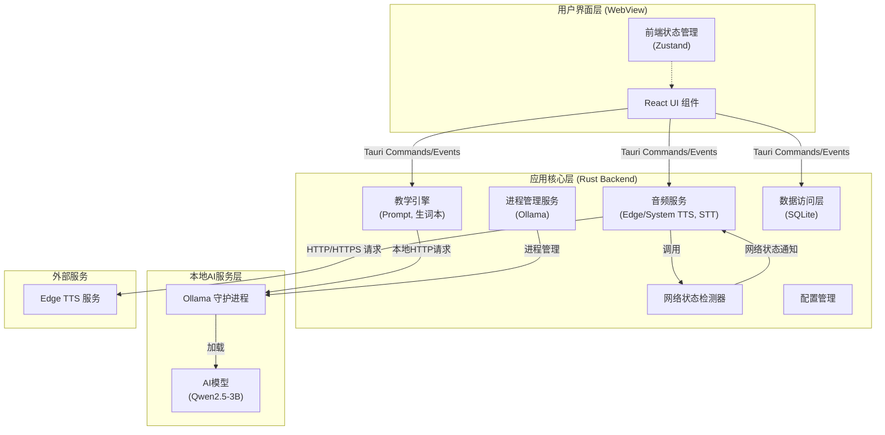
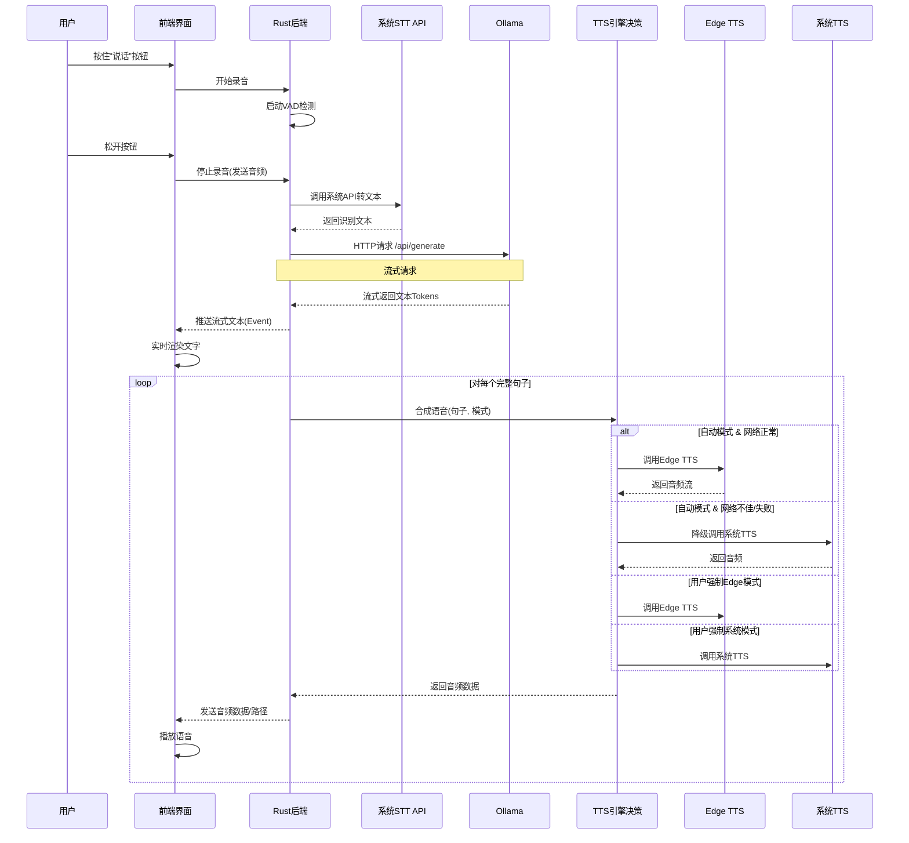
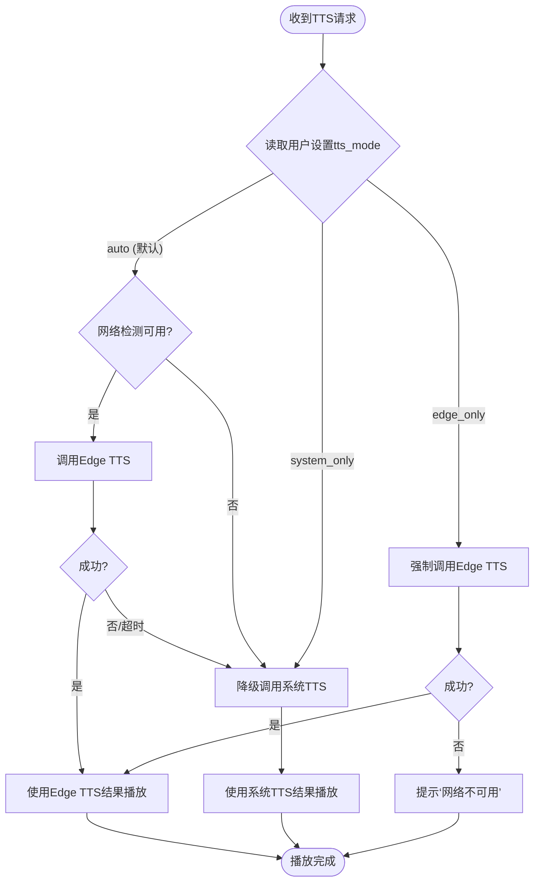
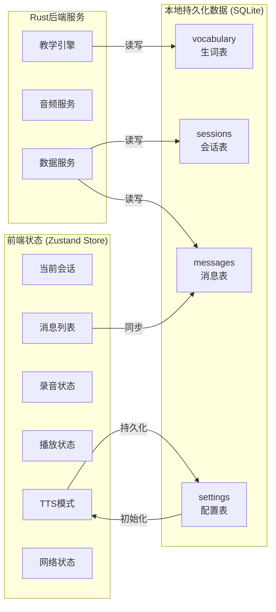
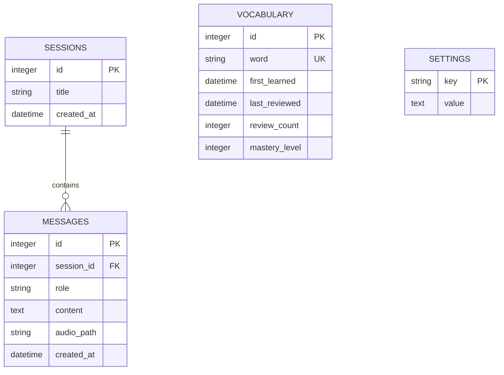
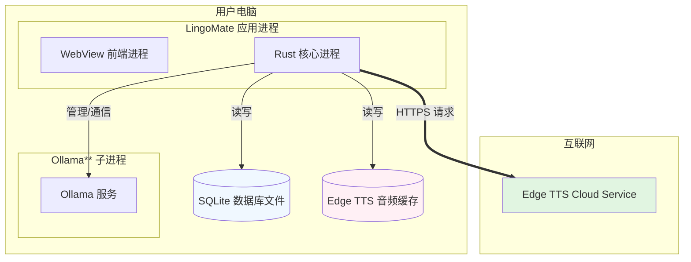
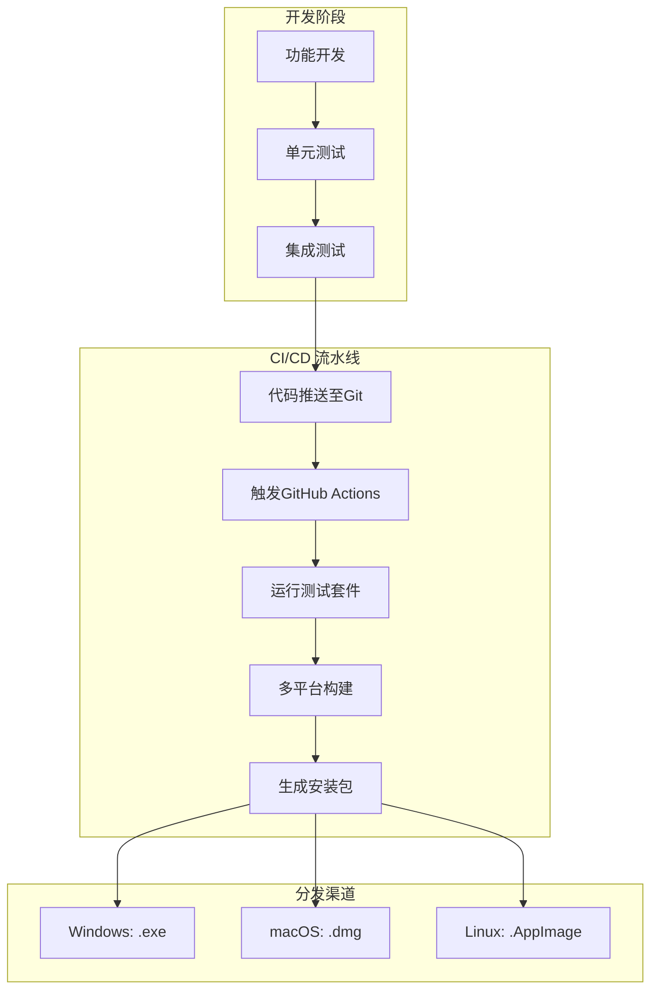
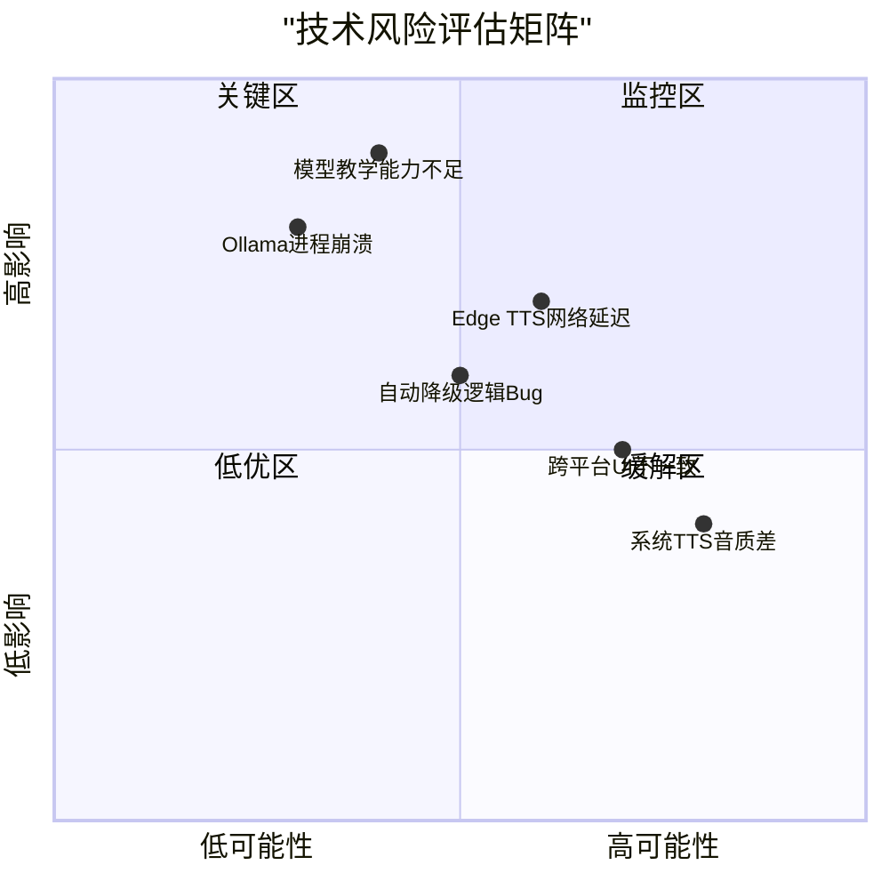

# **LingoMate 一体化桌面应用 技术架构与实施方案 (修订版)**

## **文档状态**
| 项目 | 内容 |
| :--- | :--- |
| **文档版本** | 1.1 (修订：TTS方案更新) |
| **修订要点** | 明确语音合成（TTS）采用"**Edge TTS（在线，默认）**” + "**系统原生TTS（离线/备选）**”的分层策略，并对相关模块设计、技术风险及用户体验流程进行更新。 |
| **文档目标** | 定义LingoMate桌面应用的技术架构、模块设计与实现路径，将产品需求转化为可执行的工程蓝图。 |
| **目标读者** | 技术负责人、架构师、全栈/前端/后端开发工程师、测试工程师、产品经理。 |

## **1. 架构总览与技术选型**

### **1.1 设计原则**
1.  **一体化原则**：所有核心组件打包为单应用，实现"下载即用”。
2.  **体验优先原则**：在保证核心功能可用的前提下，优先提供最优体验（如高质量TTS）。
3.  **优雅降级原则**：当最优体验依赖的条件（如网络）不满足时，自动、无缝切换到备用方案，保证功能连续性。
4.  **资源节制原则**：在8GB内存设备上保证流畅稳定运行。
5.  **跨平台一致性原则**：一套代码构建多平台应用，核心体验一致。

### **1.2 技术栈选型与论证**
| 层级 | 选型 | 论证理由 | 备注与风险 |
| :--- | :--- | :--- | :--- |
| **应用框架** | **Tauri 2.x (Rust + Webview2 / WKWebView)** | 体积小、性能高、安全性好，Rust生态适合系统编程。 | 备选：Wails (Go)。 |
| **前端UI** | **Vite + React 18 + TypeScript + Tailwind CSS** | 现代高效开发，类型安全，样式工具成熟。 | 备选：Vue 3 + Vite。 |
| **本地AI运行时** | **Ollama (内嵌)** | 标准HTTP API，强大的模型管理，活跃生态。 | 核心，需管理其进程生命周期。 |
| **默认AI模型** | **Qwen2.5-3B-Instruct (q4_K_M)** | 在8GB设备上内存占用合理（~2GB），能力满足教学需求。 | 为高端用户提供Qwen2.5-7B作为可选。 |
| **语音识别 (STT)** | **各操作系统原生API** | 零部署、离线可用、体验与系统一致。 | *Win*: `Windows.Media.SpeechRecognition`<br>*macOS*: `SFSpeechRecognizer`<br>*Linux*: 需适配（如Vosk）。 |
| **语音合成 (TTS)** | **1. 默认在线：Edge TTS**<br>**2. 备选离线：系统原生TTS** | **Edge TTS**：提供顶级音质与跨平台一致性，是**默认体验**。<br>**系统TTS**：作为无网络或用户指定时的**保底方案**，保证功能永远可用。 | **核心变更**。需处理网络检测、自动降级、用户设置。 |
| **本地存储** | **SQLite (via `tauri-plugin-sql`)** | 轻量、单文件、Tauri原生支持。 | 用于存储对话、生词本、配置。 |

### **1.3 高层架构图**
```
                  [ 用户界面层 (WebView) ]
                          ↑↓
        Tauri Commands/Events + 前端状态管理
                          ↑↓
               [ 应用核心层 (Rust Backend) ]
    ├── 进程管理服务 (Ollama)
    ├── 音频服务 (Edge TTS客户端 + 系统TTS封装)
    ├── 网络状态检测器
    ├── 教学引擎 (Prompt, 生词本)
    ├── 数据访问层 (SQLite)
    └── 配置管理
                          ↑↓
        本地HTTP (推理) / 互联网HTTPS (TTS)
                          ↑↓
       [ Ollama ]   ↔    [ Edge TTS 服务 ]
      (localhost:11434)   (在线，默认)
           ↓
     [ AI模型加载 ]
```


## **2. 核心模块详细设计**

### **2.1 安装与部署模块**
*   **打包内容**：Tauri应用、Ollama二进制、默认模型文件（或下载器）。
*   **首次启动**：向导式模型下载与配置。**无需**打包Edge TTS，其为在线服务。

### **2.2 应用生命周期与进程管理**
（同上一版，负责Ollama进程的启动、监控、停止。）

### **2.3 语音对话流水线（关键修订）**
此为"流式、低延迟、高音质”体验的核心，**重点修订TTS部分**。

1.  **录音与VAD**：不变。
2.  **STT调用**：不变（调用系统API）。
3.  **AI推理**：不变（调用本地Ollama）。
4.  **TTS与播放（修订逻辑）**：
    ```rust
    // 伪代码：TTS引擎调用决策逻辑
    async fn synthesize_speech(text: &str, config: &TtsConfig) -> Result<AudioData> {
        match config.mode {
            TtsMode::Auto => {
                // 默认逻辑：优先尝试Edge TTS
                if network::is_available() {
                    match edge_tts::synthesize(text).await {
                        Ok(audio) => return Ok(audio),
                        Err(_) => { /* 失败，降级 */ }
                    }
                }
                // 降级到系统TTS
                system_tts::synthesize(text)
            }
            TtsMode::EdgeTtsOnly => {
                // 用户强制在线模式
                edge_tts::synthesize(text).await
            }
            TtsMode::SystemTtsOnly => {
                // 用户强制离线模式
                system_tts::synthesize(text)
            }
        }
    }
    ```
    *   **播放队列与打断**：实现全局播放队列。新的AI回复可打断正在播放的语音，清空队列并立即开始新语音合成。

### **2.4 教学引擎模块**
（同上一版，负责Prompt管理、"即点即学”、生词本逻辑。）

### **2.5 性能、网络与资源管理**
*   **网络检测**：实现轻量级、持续的网络连通性检测，用于指导TTS引擎的自动选择。
*   **TTS缓存**（增强体验）：对高频教学用语、单词发音的Edge TTS结果进行**本地磁盘缓存**，减少重复网络请求，并在弱网时提供部分离线语音。
*   **运行模式**：
    *   **流畅模式 (默认)**：Ollama使用CPU，保证稳定性。
    *   **性能模式**：Ollama尝试使用GPU加速。

## **3. 数据、状态与配置设计**

### **3.1 数据库Schema**
（同上一版，存储对话、生词、配置。）

### **3.2 前端状态管理**
需增加TTS相关状态：
```typescript
interface AppState {
  // ... 其他状态
  ttsMode: 'auto' | 'edge' | 'system'; // 用户选择的TTS模式
  networkStatus: 'online' | 'offline';
  currentTtsEngine: 'edge' | 'system' | null; // 当前实际使用的引擎
  // ...
}
```

### **3.3 用户配置**
在`settings`表中存储用户明确的TTS偏好 (`tts_mode`)。

## **4. 非功能性需求技术方案**

| 需求 | 技术实现方案 |
| :--- | :--- |
| **启动时间 ≤ 5s** | 应用优化，Ollama延迟启动。 |
| **响应延迟 ≤ 2.5s (含TTS)** | 本地AI + 流式响应。**Edge TTS网络延迟是主要挑战**，需优化：1. 预连接。2. 语音缓存。3. 设置合理的网络超时（如2秒），超时则立即降级。 |
| **8GB内存稳定运行** | 默认3B模型，内存监控与提醒。 |
| **离线功能可用性** | **STT**：依赖系统API（离线）。**TTS**：降级到系统API（离线）。**AI**：本地Ollama（离线）。**核心对话功能完全支持离线**。 |
| **跨平台一致性** | **STT/系统TTS**：各平台实现。**Edge TTS**：跨平台一致。**UI**：使用响应式与自适应组件。 |

## **5. 开发、测试与部署**

### **5.1 开发环境与项目结构**
（同上一版。）

### **5.2 测试策略（增补）**
*   **网络切换测试**：模拟网络通断，验证TTS在`Auto`模式下的自动降级与恢复行为是否正确、无缝。
*   **Edge TTS 服务模拟与降级测试**：模拟Edge TTS服务超时、失败等情况，验证系统TTS后备机制。
*   **离线场景全功能测试**：在完全无网络环境下，验证核心对话流程（STT->AI->TTS）能否通过系统TTS完成。

### **5.3 构建与分发**
（同上一版，无额外依赖。）

## **6. 里程碑、资源与风险**

### **6.1 开发路线图 (调整)**
*   **Sprint 1-2**：基础框架、Ollama集成、文字对话。
*   **Sprint 3-4**：**重点**。系统音频录制/播放；**Edge TTS & 系统TTS 双引擎集成与自动降级逻辑**；实现完整语音对话闭环。
*   **Sprint 5-6**：教学功能（情景、即点即学、生词本）。
*   **Sprint 7-8**：性能模式、UI优化、网络检测、TTS缓存、打包分发。

### **6.2 初始资源估算**
（同上一版，因TTS方案调整，音频服务开发工作量略有增加。）

### **6.3 关键技术风险与预案 (修订)**
| 风险 | 影响 | 预案 |
| :--- | :--- | :--- |
| **Edge TTS网络延迟高或不稳定** | 语音回复延迟显著增加，体验下降。 | 1. 设置短超时（如2s），快速降级系统TTS。<br>2. 实现语音缓存，减少重复请求。<br>3. 在设置中提供"仅使用系统TTS”选项。 |
| **Edge TTS服务不可用或变更** | 默认TTS功能完全失效。 | 1. 自动降级机制必须健壮。<br>2. 监控服务状态，准备更换为其他高质量TTS服务（如OpenAI TTS）的预案。 |
| **系统TTS在部分平台/语言下音质差** | 降级后体验落差大。 | 1. 在"自动”模式下，仅在网络不佳时使用系统TTS。<br>2. 未来可考虑集成**Piper TTS**作为可下载的高质量离线备选。 |
| **自动降级逻辑复杂，引发BUG** | 语音播放异常、重复或中断。 | 1. 编写详尽的单元和集成测试，覆盖所有网络和故障场景。<br>2. 简化状态机，做好日志记录，便于排查。 |

---

## **总结**

本修订版方案明确了 **"Edge TTS为默认在线引擎，系统TTS为离线后备”** 的混合TTS架构。这一决策**在追求最佳音质与跨平台一致性的同时，通过优雅降级机制坚守了‘一体化、本地优先、功能永远可用’的核心产品原则**。

**该方案的优势在于**：
1.  **用户体验最大化**：大部分用户享受顶级语音。
2.  **鲁棒性最大化**：任何网络状况下核心功能不受损。
3.  **灵活性最大化**：用户可根据需求（音质/隐私/离线）自由选择。

**下一步行动**：技术团队应首先验证**Tauri与Ollama的集成**以及**Edge TTS API的调用与降级逻辑**这两个关键技术点，确保架构基石稳固。

好的，我已将文档中描述的架构图、流程图和技术方案，全部用 Mermaid 语法重新绘制，使其更清晰、专业且易于维护。

---

## **文档状态**
| 项目 | 内容 |
| :--- | :--- |
| **文档版本** | 1.2 (修订：图表Mermaid化) |
| **修订要点** | 将所有架构图、流程图、数据流图更新为Mermaid语法，便于在Markdown文档中直接渲染和维护。 |
| **文档目标** | 定义LingoMate桌面应用的技术架构、模块设计与实现路径，将产品需求转化为可执行的工程蓝图。 |

## **1. 架构总览与技术选型**

### **1.1 高层架构图 (Mermaid)**


**图例说明**：
- **实线**：主要数据/控制流
- **虚线**：状态同步/监听
- 该图清晰展示了**四层架构**：UI层、应用核心层、本地服务层、外部服务层，以及它们之间的通信关系。

### **1.2 核心对话流程时序图 (Mermaid)**


## **2. 核心模块详细设计**

### **2.1 TTS引擎决策逻辑流程图 (Mermaid)**


### **2.2 应用状态与数据流图 (Mermaid)**


## **3. 数据库Schema关系图 (Mermaid)**


## **4. 部署与运行时架构图 (Mermaid)**


## **5. 开发与部署流水线 (Mermaid)**


## **6. 技术风险与应对策略矩阵 (Mermaid)**


---

## **总结**

本次修订将所有技术图表转换为 **Mermaid** 语法，具备以下优势：

1.  **版本可控**：图表作为代码存储在文档中，与文档一同进行版本管理。
2.  **易于维护**：当架构或流程变更时，直接修改Mermaid代码即可，无需使用外部绘图工具重新导出图片。
3.  **清晰一致**：所有图表风格统一，逻辑关系表达清晰。
4.  **便于协作**：团队成员可直接查看图表源代码，理解其设计意图。

这些Mermaid图表涵盖了从**高层架构、核心流程、数据设计、部署模型到开发流程**的完整可视化表达，是理解本技术方案的关键辅助材料。在实际的Markdown渲染环境（如GitHub、GitLab、支持Mermaid的文档平台）中，这些代码将自动渲染为可交互的矢量图表。