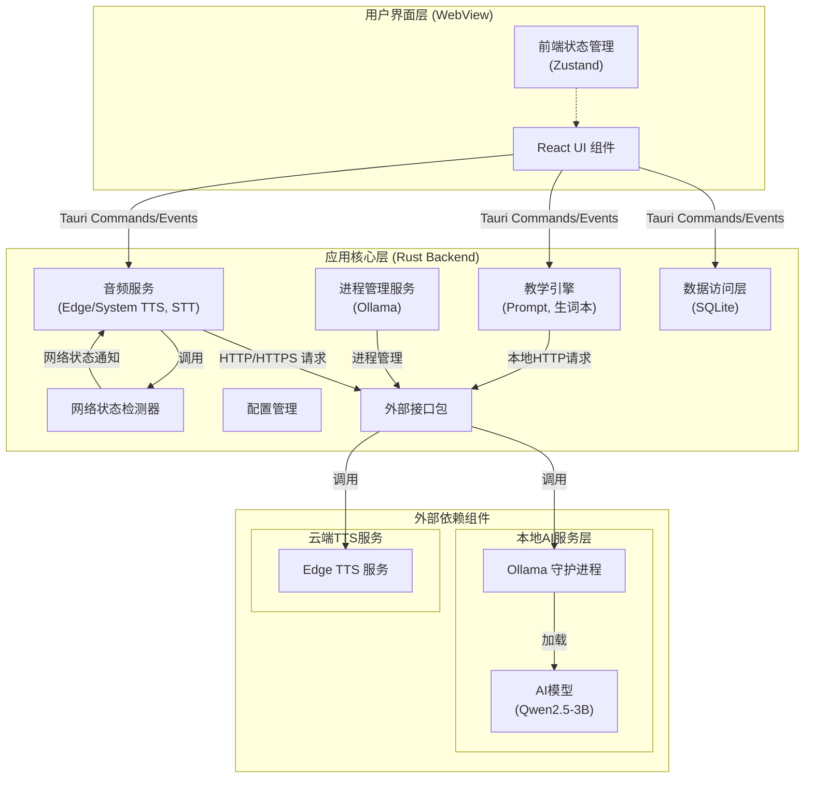
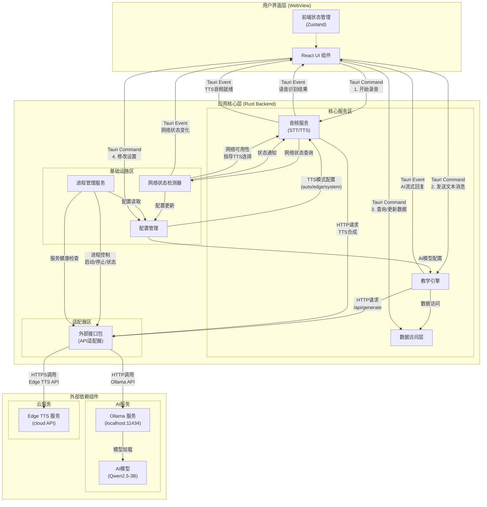
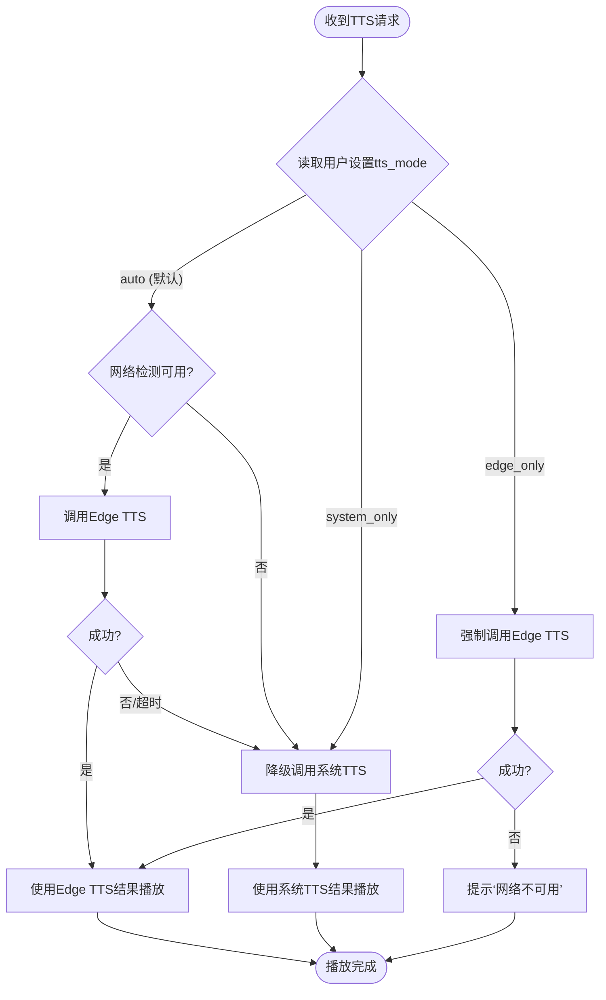
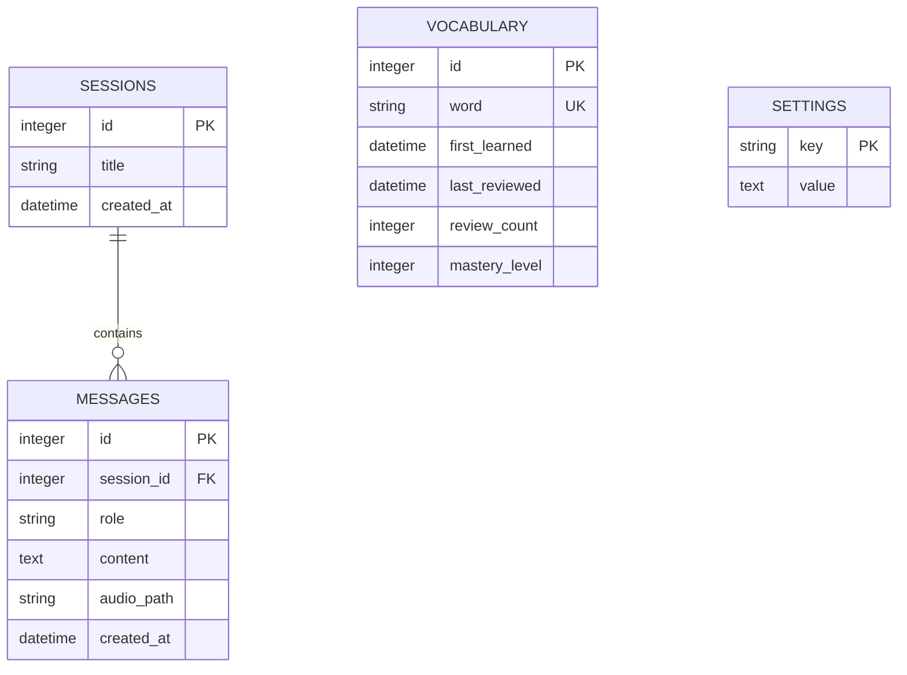
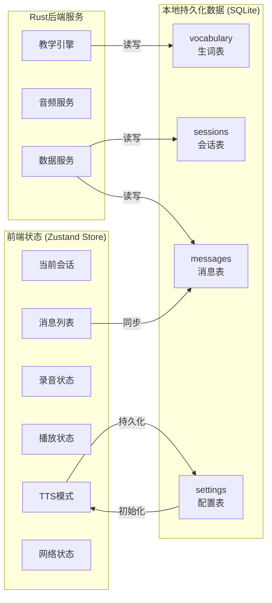
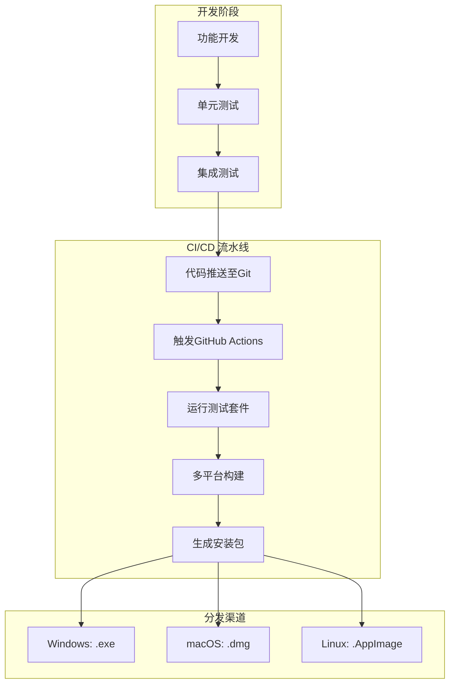
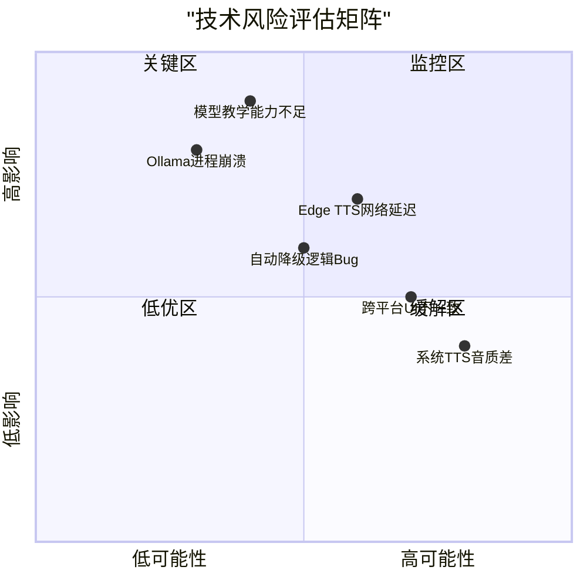

# **LingoMate 一体化桌面应用 技术架构与实施方案 (综合版)**

## **文档状态**

| 项目 | 内容 |
| :--- | :--- |
| **文档版本** | 2.0 |
| **修订历史** | 1.0: 初始版本<br>1.1: 修订TTS方案，采用“Edge TTS（默认在线）+ 系统TTS（离线备选）”分层策略<br>1.2: 将全部图表更新为Mermaid语法 |
| **文档目标** | 定义LingoMate桌面应用的核心技术架构、模块设计、实现路径、风险预案，将产品需求转化为可执行的工程蓝图。 |
| **目标读者** | 技术负责人、架构师、全栈/前端/后端开发工程师、测试工程师、产品经理。 |

## **1. 架构总览与技术选型**

### **1.1 设计原则**

1.  **一体化原则**：所有核心组件（AI模型、服务、UI）必须打包为单个应用，实现“下载即用”。
2.  **体验优先原则**：在保证核心功能可用的前提下，优先提供最优体验（如高质量TTS）。
3.  **优雅降级原则**：当高性能AI模型、高级语音引擎或网络不可用时，应有不依赖网络的后备方案，保证功能连续性。
4.  **资源节制原则**：在8GB内存的消费级设备上，必须保证核心功能的流畅与稳定。
5.  **跨平台一致性原则**：一套代码应能构建Windows、macOS、Linux应用，核心体验一致。

### **1.2 技术栈选型与论证**

| 层级 | 选型 | 论证理由 | 替代方案/风险/备注 |
| :--- | :--- | :--- | :--- |
| **应用框架** | **Tauri 2.x (Rust + Webview2 / WKWebView)** | 1. **体积与性能**：使用系统Webview，二进制体积显著小于Electron，内存占用更低。<br>2. **安全性**：进程隔离与安全通信模型更优。<br>3. **Rust生态**：适合系统级编程，易于管理本地进程和资源。 | **Wails (Go)**：也是优秀选择，但Tauri的Rust后端在系统集成和未来潜力（如WebGPU）上更被看好。 |
| **前端UI** | **Vite + React 18 + TypeScript + Tailwind CSS** | 1. **开发效率**：现代前端工具链，热重载快，生态丰富。<br>2. **类型安全**：TypeScript可大幅降低前后端通信与状态管理的错误率。<br>3. **样式**：Tailwind CSS可实现快速、一致的UI开发。 | Vue 3 + Vite 也是等效选择，取决于团队技术栈。 |
| **本地AI运行时** | **Ollama (内嵌)** | 1. **标准接口**：提供统一的`/api/generate`等HTTP API，易于集成。<br>2. **模型管理**：内置模型拉取、加载、卸载功能。<br>3. **活跃生态**：支持大多数主流开源模型。 | 直接使用`llama.cpp`库集成控制更细，但需自行实现模型管理与服务化，开发成本高。 |
| **默认AI模型** | **Qwen2.5-3B-Instruct (q4_K_M量化)** | 1. **性能平衡**：3B参数在8GB设备上留有充足内存余量（约2-3GB），确保应用本体流畅运行。<br>2. **能力足够**：在英语教学、对话任务上已验证有良好表现。 | Qwen2.5-7B-Q4_K_M：为高端用户提供的可选项，但需明确标注16GB+内存建议。 |
| **语音识别 (STT)** | **各操作系统原生API** | 1. **零部署**：无需集成模型文件，节省磁盘和内存。<br>2. **体验一致**：与系统输入法语音识别体验相同。<br>3. **免费离线**：大部分支持离线识别。 | *Windows*: `Windows.Media.SpeechRecognition`<br>*macOS*: `SFSpeechRecognizer`<br>*Linux*: 需调研`SpeechDispatcher`或Vosk（轻量本地模型）。 |
| **语音合成 (TTS)** | **1. 默认在线：Edge TTS**<br>**2. 备选离线：系统原生TTS** | **Edge TTS**：提供顶级音质与跨平台一致性，是**默认体验**。<br>**系统TTS**：作为无网络或用户指定时的**保底方案**，保证功能永远可用。 | *Windows*: `System.Speech.Synthesis` 或 `Windows.Media.SpeechSynthesis`<br>*macOS*: `AVSpeechSynthesizer`<br>**备选**：未来可集成**Piper TTS**作为可下载的高质量离线备选。 |
| **本地数据存储** | **SQLite (通过`tauri-plugin-sql`)** | 1. **轻量单文件**：易于备份和迁移。<br>2. **Tauri原生支持**：插件提供安全、易用的异步API。<br>3. **性能**：完全满足聊天记录、生词本存储需求。 | 直接使用Rust的`rusqlite`或`sqlx`库，控制更细，但需自行处理前端通信。 |

### **1.3 高层架构图**



**核心通信路径**：
1.  **用户交互**：前端UI通过Tauri Commands/Events与Rust后端通信。
2.  **AI推理**：教学引擎通过本地HTTP向Ollama服务发送请求并接收流式响应。
3.  **语音合成**：音频服务根据网络状态和用户配置，决策调用**Edge TTS（在线）** 或**系统TTS（离线）**。
4.  **数据持久化**：数据访问层操作SQLite数据库。

5. **调用关系**清晰化梳理




## **2. 核心模块详细设计**

### **2.1 安装与部署模块**

*   **打包内容**：
    *   Tauri应用主体
    *   Ollama二进制文件（对应平台）
    *   默认模型文件 (`qwen2.5:3b`)，或首次启动下载脚本
    *   （无需打包Edge TTS，其为在线服务）
*   **首次启动流程**：
    1.  检查`~/.lingomate/models`目录下是否存在模型。
    2.  如不存在，弹出友好对话框，告知用户需要下载约2GB的AI核心，并显示进度条。
    3.  下载完成后，自动解压并注册到本地Ollama（`ollama create lingomate -f Modelfile`）。
*   **静默更新**：Ollama运行时和模型可通过应用内更新机制静默升级。

### **2.2 应用生命周期与进程管理**

```rust
// 伪代码示意
struct AppState {
    ollama_handle: ChildProcess, // Ollama子进程句柄
    ollama_health: bool,         // 健康状态
}

// 启动时
fn startup() {
    // 1. 检查Ollama是否已在运行（端口11434）
    // 2. 若未运行，从应用资源路径启动./ollama serve
    // 3. 等待健康检查通过
    // 4. 检查所需模型是否存在，若不存在则触发首次下载流程
}

// 关闭时
fn shutdown() {
    // 1. 发送优雅停止信号给Ollama子进程
    // 2. 等待进程退出
    // 3. 保存所有应用状态
}
```

### **2.3 语音对话流水线**

这是实现“流式、低延迟、高音质”体验的核心。

1.  **录音与VAD**：
    *   使用Tauri插件`tauri-plugin-audio`或系统API录音。
    *   集成轻量级VAD（如`silero-vad`）在Rust端实时检测语音端点，用户松开按钮或静音超时后自动停止。

2.  **STT调用**：
    *   Rust后端封装系统特定API。异步调用，返回识别文本。
    *   **错误处理**：网络超时、权限拒绝、识别失败时，前端给予明确反馈（如“请检查麦克风权限”）。

3.  **AI推理与流式响应**：
    *   Rust后端构造完整Prompt（系统指令 + 历史 + 用户输入）。
    *   向`http://localhost:11434/api/generate`发送POST请求，设置`stream: true`。
    *   使用Server-Sent Events (SSE) 或分块读取响应体，实时将`response`字段通过Tauri Event推送到前端。

4.  **TTS与播放（核心修订点）**：
    *   前端收到流式文本，一方面渲染，一方面累积完整句子（以句号、问号等分割）。
    *   将完整句子通过Tauri Command发送给Rust后端。
    *   Rust后端根据以下决策逻辑合成语音：


    *   **播放队列与打断**：实现一个全局播放队列。当新的AI文本开始生成时，可发送中断信号清空队列并立即开始新语音的合成与播放。
    *   **TTS缓存**：对高频教学用语、单词发音的Edge TTS结果进行**本地磁盘缓存**，减少重复网络请求，提升弱网体验。

### **2.4 教学引擎模块**

*   **Prompt管理**：
    *   Prompt模板以文件形式存储在应用配置目录。
    *   根据用户选择的“情景模式”（如“咖啡店”、“面试”）加载不同的系统Prompt。
    *   “即点即学”功能：当用户双击单词`WORD`时，前端发送命令，Rust后端将用户消息替换为：`[Teach me the word: "WORD". Use the heuristic teaching method: explain in simple English, give an example, then ask me a question using it.]`
*   **生词本与复习**：
    *   所有被“即点即学”的单词自动存入`vocabulary`表。
    *   每次对话开始时，教学引擎从生词本中按遗忘曲线算法挑选1-2个单词，在对话前几个回合中由AI自然引入。

### **2.5 性能、网络与资源管理**

*   **网络检测**：实现轻量级、持续的网络连通性检测，用于指导TTS引擎的自动选择。
*   **两种AI运行模式**：
    *   **流畅模式 (默认)**：设置环境变量`OLLAMA_NUM_THREAD=4`，`OLLAMA_GPU_LAYERS=0`，强制CPU推理，保证稳定性。
    *   **性能模式**：自动检测可用GPU内存，尝试设置`OLLAMA_GPU_LAYERS=20`或更高，以利用GPU加速。
*   **内存监控**：Rust后端定时检查Ollama进程内存占用，超过阈值（如物理内存的70%）时，在前端提示“内存占用较高，建议关闭其他程序或重启应用”。
*   **模型热切换**：在设置界面切换模型时，后台自动执行`ollama stop` & `ollama run <new-model>`。

## **3. 数据、状态与配置设计**

### **3.1 数据库Schema (SQLite)**

```sql
-- 对话会话
CREATE TABLE sessions (
    id INTEGER PRIMARY KEY,
    title TEXT, -- 自动生成，如"Coffee Shop Practice"
    created_at DATETIME DEFAULT CURRENT_TIMESTAMP
);
-- 对话消息
CREATE TABLE messages (
    id INTEGER PRIMARY KEY,
    session_id INTEGER REFERENCES sessions(id),
    role TEXT CHECK(role IN ('user', 'assistant')),
    content TEXT,
    audio_path TEXT, -- 语音文件存储路径（可选）
    created_at DATETIME DEFAULT CURRENT_TIMESTAMP
);
-- 个人生词本
CREATE TABLE vocabulary (
    id INTEGER PRIMARY KEY,
    word TEXT UNIQUE,
    first_learned DATETIME DEFAULT CURRENT_TIMESTAMP,
    last_reviewed DATETIME,
    review_count INTEGER DEFAULT 0,
    mastery_level INTEGER DEFAULT 0 -- 0-5
);
-- 应用配置
CREATE TABLE settings (
    key TEXT PRIMARY KEY,
    value TEXT
);
```



### **3.2 前端状态管理 (Zustand推荐)**

```typescript
interface AppState {
  // 对话状态
  currentSession: Session | null;
  messages: Message[];
  isRecording: boolean;
  isPlaying: boolean;
  // 应用状态
  aiModel: string;
  performanceMode: 'fluent' | 'performance';
  ttsMode: 'auto' | 'edge' | 'system'; // 用户TTS偏好
  currentTtsEngine: 'edge' | 'system' | null; // 当前实际使用引擎
  networkStatus: 'online' | 'offline';
  // 方法
  startRecording: () => Promise<void>;
  sendMessage: (text: string) => Promise<void>;
  // ...
}
```

### **3.3 应用状态与数据流**



## **4. 非功能性需求技术方案**

| 需求 | 技术实现方案 |
| :--- | :--- |
| **启动时间 ≤ 5s** | 1. 应用二进制优化。2. Ollama服务延迟启动：应用UI就绪后再异步启动Ollama健康检查。3. 前端资源懒加载。 |
| **响应延迟 ≤ 2.5s (含TTS)** | 1. VAD端点检测实时。2. 系统STT优化（可能需预加载）。3. Ollama使用量化模型，首次Token生成时间短。<br>**4. Edge TTS网络延迟是主要挑战**，需优化：预连接、语音缓存、设置短超时（如2秒）后降级。 |
| **8GB内存稳定运行** | 1. 默认使用3B模型。2. 流畅模式强制CPU，避免GPU内存占用。3. 提供“一键释放内存”按钮，可重启Ollama进程。 |
| **离线功能可用性** | **STT**：依赖系统API（离线）。**TTS**：降级到系统API（离线）。**AI**：本地Ollama（离线）。**核心对话功能完全支持离线**。 |
| **跨平台兼容** | 1. Tauri抽象系统差异。2. STT/系统TTS为各平台实现特定后端。3. Edge TTS提供一致在线体验。4. 使用CI进行多平台构建与测试。 |

## **5. 开发、测试与部署**

### **5.1 开发环境与项目结构**

1.  **前置依赖**：Rust, Node.js, pnpm。
2.  **项目结构**：
    ```
    lingomate/
    ├── src-tauri/          # Rust后端
    │   ├── src/
    │   │   ├── main.rs
    │   │   ├── ollama_manager.rs
    │   │   ├── audio_service.rs # 包含Edge/System TTS决策
    │   │   ├── network_detector.rs
    │   │   └── ...
    │   └── Cargo.toml
    ├── src/                # 前端
    │   ├── main.tsx
    │   ├── components/
    │   └── stores/
    ├── public/             # 静态资源
    ├── resources/          # 打包资源（Ollama二进制，初始模型）
    └── ...
    ```

### **5.2 测试策略**

*   **单元测试**：Rust后端的核心逻辑（如Prompt构造、生词本算法、TTS决策逻辑）。
*   **集成测试**：模拟Ollama HTTP API和Edge TTS服务，测试完整对话链条及降级逻辑。
*   **网络切换测试**：模拟网络通断，验证TTS在`Auto`模式下的自动降级与恢复行为。
*   **端到端测试 (Playwright)**：测试关键用户流程，如安装、首次对话、单词点击教学、TTS模式切换。
*   **性能测试**：在不同配置的虚拟机/实体机上测试内存占用、响应延迟及TTS切换耗时。

### **5.3 构建与分发**

1.  **CI/CD (GitHub Actions)**：自动为三个平台构建。
2.  **打包**：
    *   Windows: NSIS安装程序，包含VC++运行库。
    *   macOS: `.dmg`映像，可能需要公证(Notarization)。
    *   Linux: `.AppImage`通用包。
3.  **更新**：集成`tauri-plugin-updater`实现应用内自动更新。



## **6. 里程碑、资源与风险**

### **6.1 开发路线图**

*   **Sprint 1-2 (核心框架)**：Tauri项目初始化；Ollama进程集成与基础文本对话。
*   **Sprint 3-4 (语音闭环)**：系统音频录制与播放；**Edge TTS & 系统TTS 双引擎集成与自动降级逻辑**；实现完整语音对话流。
*   **Sprint 5-6 (教学功能)**：情景模式与Prompt管理；单词即点即学；生词本与本地数据库。
*   **Sprint 7-8 (打磨与分发)**：性能模式与模型管理；网络检测、TTS缓存；UI/UX抛光；多平台打包与测试。

### **6.2 初始资源估算**

*   **开发**：1名全栈（熟悉Rust/Tauri）、1名前端（React/TS）、共计约4-5人月。
*   **测试**：1名QA工程师，持续参与。
*   **设备**：需备有Windows、macOS、Linux实体机用于测试。

### **6.3 关键技术风险与预案**



| 风险 | 影响 | 预案 |
| :--- | :--- | :--- |
| **Edge TTS网络延迟高或不稳定** | 语音回复延迟显著增加，体验下降。 | 1. 设置短超时（如2s），快速降级系统TTS。<br>2. 实现语音缓存，减少重复请求。<br>3. 在设置中提供“仅使用系统TTS”选项。 |
| **Edge TTS服务不可用或变更** | 默认TTS功能完全失效。 | 1. 自动降级机制必须健壮。<br>2. 监控服务状态，准备更换为其他高质量TTS服务（如OpenAI TTS）的预案。 |
| **Ollama进程在低内存设备上崩溃** | 对话中断，用户体验差。 | 1. 实现进程守护，崩溃后自动重启并恢复对话。<br>2. 在设置中明确“流畅模式”为低内存设备推荐。 |
| **系统TTS在部分平台/语言下音质差** | 降级后体验落差大。 | 1. 在“自动”模式下，仅在网络不佳时使用系统TTS。<br>2. 未来可考虑集成**Piper TTS**作为可下载的高质量离线备选。 |
| **自动降级逻辑复杂，引发BUG** | 语音播放异常、重复或中断。 | 1. 编写详尽的单元和集成测试，覆盖所有网络和故障场景。<br>2. 简化状态机，做好日志记录，便于排查。 |
| **3B模型的教学能力不达预期** | 教学效果打折扣，用户留存低。 | 1. 精心优化Prompt工程。<br>2. 在应用内提供便捷的“升级到7B模型”引导，并明确硬件要求。<br>3. 持续关注并快速集成更优的小模型。 |

---

## **总结**

本综合方案为构建**LingoMate**一体化桌面应用提供了从架构到实施的全景技术路线图。其核心在于：

1.  **轻量跨平台容器**：利用**Tauri**实现高性能、小体积的桌面应用基础。
2.  **本地AI大脑**：通过**内嵌和管理Ollama**提供完全离线的AI对话与教学能力。
3.  **分层语音策略**：采用 **“Edge TTS（在线优质默认）+ 系统原生TTS（离线可靠后备）”** 的混合架构，在追求最佳音质与跨平台一致性的同时，通过优雅降级机制确保了核心功能在任何网络条件下的可用性。
4.  **一体化体验**：将STT、AI、TTS、生词本、情景教学深度集成，提供无缝的“说-学-记”闭环。

所有设计均围绕“**在8GB内存设备上稳定、流畅地提供启发式英语教学**”这一核心约束展开，并通过详细的模块设计、数据流图、风险评估和开发路线图，将其转化为可执行、可验证的工程任务。

**下一步行动**：技术团队应首先验证**Tauri与Ollama的集成**以及**Edge TTS API的调用与降级逻辑**这两个关键技术点，确保架构基石稳固，随后按路线图开展迭代开发。