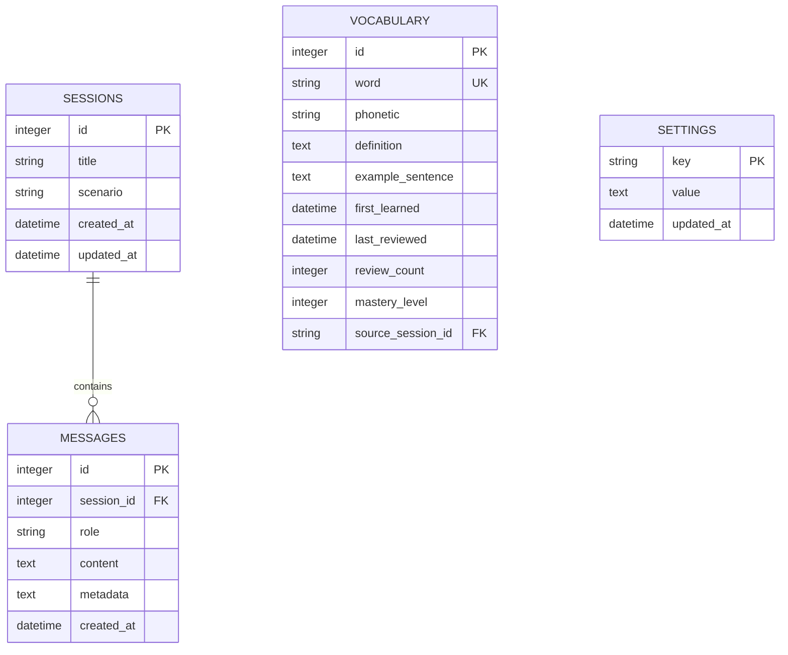

# LingoMate 数据库详细设计文档

## 文档状态

| 项目 | 内容 |
| :--- | :--- |
| **文档版本** | 1.0 |
| **创建日期** | 2026-05-17 |
| **适用版本** | MVP v0.9+ |
| **维护者** | 后端开发团队 |

---

## 1. 数据库选型

### 1.1 技术选择

**SQLite** - 轻量级嵌入式关系型数据库

**选择理由**:
- ✅ 单文件存储,易于备份和迁移
- ✅ Tauri 官方插件支持 (`tauri-plugin-sql`)
- ✅ 零配置,无需独立数据库服务
- ✅ 性能足够满足 MVP 需求 (聊天记录、生词本)
- ✅ ACID 事务保证数据一致性

### 1.2 数据库文件位置

```
Windows: %APPDATA%\com.lingomate.app\lingomate.db
macOS:   ~/Library/Application Support/com.lingomate.app/lingomate.db
Linux:   ~/.local/share/com.lingomate.app/lingomate.db
```

---

## 2. 数据库 Schema

### 2.1 ER 图



---

### 2.2 表结构详细定义

#### 表 1: `sessions` (对话会话)

存储每次对话会话的元数据。

```sql
CREATE TABLE sessions (
    id INTEGER PRIMARY KEY AUTOINCREMENT,
    title TEXT NOT NULL DEFAULT 'New Conversation',
    scenario TEXT NOT NULL CHECK(scenario IN (
        'coffee_shop', 
        'restaurant', 
        'hotel_checkin', 
        'job_interview', 
        'airport', 
        'social_gathering'
    )),
    proficiency_level TEXT NOT NULL DEFAULT 'intermediate' 
        CHECK(proficiency_level IN ('beginner', 'intermediate', 'advanced')),
    created_at DATETIME NOT NULL DEFAULT CURRENT_TIMESTAMP,
    updated_at DATETIME NOT NULL DEFAULT CURRENT_TIMESTAMP,
    message_count INTEGER NOT NULL DEFAULT 0
);

-- 索引
CREATE INDEX idx_sessions_created_at ON sessions(created_at DESC);
CREATE INDEX idx_sessions_scenario ON sessions(scenario);
CREATE INDEX idx_sessions_updated_at ON sessions(updated_at DESC);

-- 触发器: 自动更新 updated_at
CREATE TRIGGER update_sessions_timestamp 
AFTER UPDATE ON sessions
BEGIN
    UPDATE sessions SET updated_at = CURRENT_TIMESTAMP WHERE id = NEW.id;
END;
```

**字段说明**:

| 字段 | 类型 | 约束 | 说明 | 示例 |
| :--- | :--- | :--- | :--- | :--- |
| `id` | INTEGER | PK, AUTOINCREMENT | 会话唯一标识 | 1, 2, 3... |
| `title` | TEXT | NOT NULL, DEFAULT | 会话标题(自动生成) | "Coffee Shop Practice" |
| `scenario` | TEXT | NOT NULL, CHECK | 情景模式 | "coffee_shop" |
| `proficiency_level` | TEXT | NOT NULL, DEFAULT, CHECK | 用户英语水平 | "intermediate" |
| `created_at` | DATETIME | NOT NULL, DEFAULT | 创建时间 | "2026-05-17 10:30:00" |
| `updated_at` | DATETIME | NOT NULL, DEFAULT | 最后更新时间 | "2026-05-17 11:45:00" |
| `message_count` | INTEGER | NOT NULL, DEFAULT | 消息总数 | 24 |

---

#### 表 2: `messages` (对话消息)

存储每条对话消息的内容和元数据。

```sql
CREATE TABLE messages (
    id INTEGER PRIMARY KEY AUTOINCREMENT,
    session_id INTEGER NOT NULL REFERENCES sessions(id) ON DELETE CASCADE,
    role TEXT NOT NULL CHECK(role IN ('user', 'assistant', 'system')),
    content TEXT NOT NULL,
    metadata TEXT DEFAULT '{}',  -- JSON 格式
    created_at DATETIME NOT NULL DEFAULT CURRENT_TIMESTAMP
);

-- 索引
CREATE INDEX idx_messages_session_id ON messages(session_id);
CREATE INDEX idx_messages_created_at ON messages(created_at);
CREATE INDEX idx_messages_role ON messages(role);

-- 外键约束
PRAGMA foreign_keys = ON;
```

**字段说明**:

| 字段 | 类型 | 约束 | 说明 | 示例 |
| :--- | :--- | :--- | :--- | :--- |
| `id` | INTEGER | PK, AUTOINCREMENT | 消息唯一标识 | 1, 2, 3... |
| `session_id` | INTEGER | NOT NULL, FK | 所属会话 ID | 1 |
| `role` | TEXT | NOT NULL, CHECK | 消息角色 | "user", "assistant", "system" |
| `content` | TEXT | NOT NULL | 消息内容 | "I'd like a latte, please." |
| `metadata` | TEXT | DEFAULT '{}' | JSON 元数据 | `{"word_count": 6, "audio_path": "/path/to/audio.mp3"}` |
| `created_at` | DATETIME | NOT NULL, DEFAULT | 创建时间 | "2026-05-17 10:31:15" |

**metadata JSON 结构**:

```json
{
  "word_count": 6,
  "character_count": 28,
  "audio_path": "/Users/admin/Library/Audio/msg_123.mp3",
  "tts_engine": "edge",
  "stt_confidence": 0.95,
  "contains_vocabulary": ["latte"]
}
```

---

#### 表 3: `vocabulary` (生词本)

存储用户学习过的单词及其掌握程度。

```sql
CREATE TABLE vocabulary (
    id INTEGER PRIMARY KEY AUTOINCREMENT,
    word TEXT NOT NULL UNIQUE COLLATE NOCASE,
    phonetic TEXT,
    definition TEXT,
    example_sentence TEXT,
    first_learned DATETIME NOT NULL DEFAULT CURRENT_TIMESTAMP,
    last_reviewed DATETIME,
    next_review_date DATETIME,
    review_count INTEGER NOT NULL DEFAULT 0,
    mastery_level INTEGER NOT NULL DEFAULT 0 CHECK(mastery_level BETWEEN 0 AND 5),
    source_session_id INTEGER REFERENCES sessions(id) ON DELETE SET NULL,
    source_message_id INTEGER REFERENCES messages(id) ON DELETE SET NULL,
    user_notes TEXT,
    created_at DATETIME NOT NULL DEFAULT CURRENT_TIMESTAMP,
    updated_at DATETIME NOT NULL DEFAULT CURRENT_TIMESTAMP
);

-- 索引
CREATE INDEX idx_vocabulary_word ON vocabulary(word);
CREATE INDEX idx_vocabulary_mastery ON vocabulary(mastery_level);
CREATE INDEX idx_vocabulary_next_review ON vocabulary(next_review_date);
CREATE INDEX idx_vocabulary_first_learned ON vocabulary(first_learned DESC);

-- 触发器: 自动更新 updated_at
CREATE TRIGGER update_vocabulary_timestamp 
AFTER UPDATE ON vocabulary
BEGIN
    UPDATE vocabulary SET updated_at = CURRENT_TIMESTAMP WHERE id = NEW.id;
END;
```

**字段说明**:

| 字段 | 类型 | 约束 | 说明 | 示例 |
| :--- | :--- | :--- | :--- | :--- |
| `id` | INTEGER | PK, AUTOINCREMENT | 单词唯一标识 | 1, 2, 3... |
| `word` | TEXT | NOT NULL, UNIQUE | 单词(不区分大小写) | "procrastinate" |
| `phonetic` | TEXT | NULL | 音标 | "/prəˈkræstɪneɪt/" |
| `definition` | TEXT | NULL | 英文释义 | "to delay doing something" |
| `example_sentence` | TEXT | NULL | 例句 | "I always procrastinate on homework." |
| `first_learned` | DATETIME | NOT NULL, DEFAULT | 首次学习时间 | "2026-05-15 14:20:00" |
| `last_reviewed` | DATETIME | NULL | 最后复习时间 | "2026-05-17 09:30:00" |
| `next_review_date` | DATETIME | NULL | 下次复习日期 | "2026-05-20 09:30:00" |
| `review_count` | INTEGER | NOT NULL, DEFAULT | 复习次数 | 3 |
| `mastery_level` | INTEGER | NOT NULL, DEFAULT, CHECK | 掌握程度 (0-5) | 2 |
| `source_session_id` | INTEGER | FK, NULL | 来源会话 ID | 5 |
| `source_message_id` | INTEGER | FK, NULL | 来源消息 ID | 42 |
| `user_notes` | TEXT | NULL | 用户笔记 | "常拼错,注意 'cras' 部分" |
| `created_at` | DATETIME | NOT NULL, DEFAULT | 记录创建时间 | "2026-05-15 14:20:00" |
| `updated_at` | DATETIME | NOT NULL, DEFAULT | 最后更新时间 | "2026-05-17 09:30:00" |

**掌握程度 (mastery_level) 定义**:

| Level | 名称 | 含义 | 复习间隔 |
| :--- | :--- | :--- | :--- |
| 0 | New | 首次学习 | 立即复习 |
| 1 | Familiar | 初步了解 | 1天后 |
| 2 | Learning | 基本掌握 | 3天后 |
| 3 | Proficient | 较为熟练 | 7天后 |
| 4 | Mastered | 熟练掌握 | 14天后 |
| 5 | Native-like | 完全掌握 | 30天后 |

---

#### 表 4: `settings` (应用设置)

存储用户个性化配置。

```sql
CREATE TABLE settings (
    key TEXT PRIMARY KEY,
    value TEXT NOT NULL,
    type TEXT NOT NULL DEFAULT 'string' 
        CHECK(type IN ('string', 'number', 'boolean', 'json')),
    description TEXT,
    updated_at DATETIME NOT NULL DEFAULT CURRENT_TIMESTAMP
);

-- 触发器: 自动更新 updated_at
CREATE TRIGGER update_settings_timestamp 
AFTER UPDATE ON settings
BEGIN
    UPDATE settings SET updated_at = CURRENT_TIMESTAMP WHERE key = NEW.key;
END;

-- 插入默认设置
INSERT INTO settings (key, value, type, description) VALUES
    ('ai_model', 'qwen2.5:3b', 'string', '当前使用的 AI 模型'),
    ('performance_mode', 'fluent', 'string', '性能模式: fluent 或 performance'),
    ('tts_mode', 'auto', 'string', 'TTS 模式: auto, edge_only, system_only'),
    ('current_voice', 'default', 'string', '当前音色: default, male, female'),
    ('speech_speed', '1.0', 'number', '语速: 0.5-2.0'),
    ('speech_volume', '1.0', 'number', '音量: 0.0-1.0'),
    ('show_grammar_hints', 'true', 'boolean', '是否显示语法提示'),
    ('user_nickname', '', 'string', '用户昵称'),
    ('user_level', 'intermediate', 'string', '用户英语水平'),
    ('theme', 'light', 'string', '主题: light 或 dark');
```

**字段说明**:

| 字段 | 类型 | 约束 | 说明 | 示例 |
| :--- | :--- | :--- | :--- | :--- |
| `key` | TEXT | PK | 设置键名 | "ai_model" |
| `value` | TEXT | NOT NULL | 设置值 | "qwen2.5:3b" |
| `type` | TEXT | NOT NULL, DEFAULT, CHECK | 值类型 | "string", "number", "boolean", "json" |
| `description` | TEXT | NULL | 设置说明 | "当前使用的 AI 模型" |
| `updated_at` | DATETIME | NOT NULL, DEFAULT | 最后更新时间 | "2026-05-17 10:00:00" |

---

## 3. 常用查询示例

### 3.1 会话相关查询

#### 获取最近 20 个会话

```sql
SELECT 
    id, 
    title, 
    scenario, 
    created_at, 
    message_count
FROM sessions
ORDER BY updated_at DESC
LIMIT 20 OFFSET 0;
```

#### 创建新会话

```sql
INSERT INTO sessions (title, scenario, proficiency_level)
VALUES ('Coffee Shop Practice', 'coffee_shop', 'intermediate')
RETURNING id;
```

#### 删除会话及其所有消息

```sql
DELETE FROM sessions WHERE id = ?;
-- ON DELETE CASCADE 会自动删除关联的 messages
```

---

### 3.2 消息相关查询

#### 获取会话的所有消息

```sql
SELECT 
    m.id,
    m.session_id,
    m.role,
    m.content,
    m.metadata,
    m.created_at
FROM messages m
WHERE m.session_id = ?
ORDER BY m.created_at ASC;
```

#### 获取会话的消息数量

```sql
SELECT COUNT(*) as message_count
FROM messages
WHERE session_id = ?;
```

#### 插入新消息

```sql
INSERT INTO messages (session_id, role, content, metadata)
VALUES (?, ?, ?, ?)
RETURNING id;
```

**参数示例**:
```rust
let params = rusqlite::params![
    session_id,
    "user",
    "I'd like a latte, please.",
    r#"{"word_count": 6}"#
];
```

---

### 3.3 生词本相关查询

#### 获取所有生词 (按掌握程度排序)

```sql
SELECT 
    id,
    word,
    phonetic,
    definition,
    example_sentence,
    first_learned,
    last_reviewed,
    review_count,
    mastery_level
FROM vocabulary
ORDER BY mastery_level ASC, first_learned DESC;
```

#### 获取需要复习的单词

```sql
SELECT *
FROM vocabulary
WHERE next_review_date <= CURRENT_TIMESTAMP
   OR next_review_date IS NULL
ORDER BY next_review_date ASC
LIMIT 5;
```

#### 添加新单词

```sql
INSERT INTO vocabulary (
    word, 
    phonetic, 
    definition, 
    example_sentence,
    source_session_id,
    source_message_id
)
VALUES (?, ?, ?, ?, ?, ?)
ON CONFLICT(word) DO NOTHING
RETURNING id;
```

#### 更新单词掌握程度

```sql
UPDATE vocabulary
SET 
    mastery_level = ?,
    review_count = review_count + 1,
    last_reviewed = CURRENT_TIMESTAMP,
    next_review_date = CASE ?
        WHEN 0 THEN datetime('now', '+0 days')
        WHEN 1 THEN datetime('now', '+1 days')
        WHEN 2 THEN datetime('now', '+3 days')
        WHEN 3 THEN datetime('now', '+7 days')
        WHEN 4 THEN datetime('now', '+14 days')
        WHEN 5 THEN datetime('now', '+30 days')
    END
WHERE id = ?;
```

#### 搜索单词

```sql
SELECT *
FROM vocabulary
WHERE word LIKE '%' || ? || '%'
ORDER BY word ASC
LIMIT 20;
```

---

### 3.4 设置相关查询

#### 获取单个设置

```sql
SELECT value
FROM settings
WHERE key = ?;
```

#### 更新设置

```sql
INSERT INTO settings (key, value, type)
VALUES (?, ?, ?)
ON CONFLICT(key) DO UPDATE SET 
    value = excluded.value,
    updated_at = CURRENT_TIMESTAMP;
```

#### 获取所有设置

```sql
SELECT key, value, type
FROM settings;
```

---

## 4. 数据迁移方案

### 4.1 版本管理

使用 `user_version` PRAGMA 跟踪数据库版本:

```sql
-- 检查当前版本
PRAGMA user_version;

-- 设置版本
PRAGMA user_version = 1;
```

### 4.2 迁移脚本示例

#### V1 → V2: 添加 `phonetic` 字段

```sql
-- migration_v1_to_v2.sql
BEGIN TRANSACTION;

ALTER TABLE vocabulary ADD COLUMN phonetic TEXT;

PRAGMA user_version = 2;

COMMIT;
```

#### Rust 实现自动迁移

```rust
use rusqlite::Connection;

fn migrate_database(conn: &Connection) -> Result<(), rusqlite::Error> {
    let current_version: i32 = conn.pragma_query_value(None, "user_version", |row| row.get(0))?;
    
    if current_version < 1 {
        // 执行 V1 初始化
        conn.execute_batch(include_str!("migrations/v1_init.sql"))?;
        conn.pragma_update(None, "user_version", 1)?;
    }
    
    if current_version < 2 {
        // 执行 V2 迁移
        conn.execute_batch(include_str!("migrations/v1_to_v2.sql"))?;
        conn.pragma_update(None, "user_version", 2)?;
    }
    
    Ok(())
}
```

---

## 5. 性能优化

### 5.1 索引策略

**已创建的索引**:

| 表 | 索引字段 | 用途 |
| :--- | :--- | :--- |
| `sessions` | `created_at DESC` | 快速获取最新会话 |
| `sessions` | `scenario` | 按情景筛选会话 |
| `messages` | `session_id` | 快速查询会话消息 |
| `messages` | `created_at` | 按时间排序消息 |
| `vocabulary` | `word` | 快速查找单词 |
| `vocabulary` | `mastery_level` | 按掌握程度筛选 |
| `vocabulary` | `next_review_date` | 智能复习查询 |

### 5.2 查询优化建议

1. **使用参数化查询**,避免 SQL 注入
2. **批量插入**时使用事务:

```rust
let tx = conn.unchecked_transaction()?;
for word in words {
    tx.execute(
        "INSERT INTO vocabulary (word, ...) VALUES (?, ...)",
        rusqlite::params![word, ...]
    )?;
}
tx.commit()?;
```

3. **分页查询**大结果集:

```sql
SELECT * FROM messages
WHERE session_id = ?
ORDER BY created_at ASC
LIMIT 50 OFFSET 0;
```

4. **定期清理**旧数据 (可选):

```sql
-- 删除超过 1 年的会话
DELETE FROM sessions
WHERE created_at < datetime('now', '-1 year');
```

---

## 6. 数据备份与恢复

### 6.1 备份方法

SQLite 是单文件数据库,直接复制文件即可备份:

```rust
use std::fs;

fn backup_database(db_path: &str, backup_path: &str) -> Result<(), std::io::Error> {
    fs::copy(db_path, backup_path)?;
    Ok(())
}
```

**推荐备份策略**:
- 每次应用关闭时自动备份
- 保留最近 7 天的备份
- 备份文件名: `lingomate_backup_20260517.db`

### 6.2 导出为 JSON

```rust
use serde_json;

#[derive(Serialize)]
struct ExportData {
    sessions: Vec<Session>,
    messages: Vec<Message>,
    vocabulary: Vec<VocabularyItem>,
    exported_at: String,
}

fn export_to_json(conn: &Connection) -> Result<String, rusqlite::Error> {
    let data = ExportData {
        sessions: query_all_sessions(conn)?,
        messages: query_all_messages(conn)?,
        vocabulary: query_all_vocabulary(conn)?,
        exported_at: chrono::Utc::now().to_rfc3339(),
    };
    
    Ok(serde_json::to_string_pretty(&data)?)
}
```

### 6.3 从 JSON 导入

```rust
fn import_from_json(conn: &Connection, json_data: &str) -> Result<(), rusqlite::Error> {
    let data: ExportData = serde_json::from_str(json_data)?;
    
    let tx = conn.unchecked_transaction()?;
    
    for session in data.sessions {
        tx.execute(
            "INSERT OR REPLACE INTO sessions (...) VALUES (...)",
            rusqlite::params![...]
        )?;
    }
    
    // 类似地导入 messages 和 vocabulary
    
    tx.commit()?;
    Ok(())
}
```

---

## 7. 安全考虑

### 7.1 SQL 注入防护

**❌ 错误做法** (字符串拼接):

```rust
// 危险!不要这样做
let sql = format!("SELECT * FROM users WHERE name = '{}'", user_input);
conn.execute(&sql, [])?;
```

**✅ 正确做法** (参数化查询):

```rust
conn.execute(
    "SELECT * FROM users WHERE name = ?",
    rusqlite::params![user_input]
)?;
```

### 7.2 数据库加密 (可选,MVP暂不实现)

如需加密,可使用 `sqlcipher`:

```toml
# Cargo.toml
[dependencies]
rusqlite = { version = "0.29", features = ["bundled-sqlcipher"] }
```

```rust
let conn = Connection::open(db_path)?;
conn.execute_batch("PRAGMA key = 'your-secret-key';")?;
```

---

## 8. 测试数据

### 8.1 种子数据脚本

```sql
-- seed_data.sql

-- 插入测试会话
INSERT INTO sessions (title, scenario, proficiency_level, message_count) VALUES
    ('Coffee Shop Practice', 'coffee_shop', 'intermediate', 12),
    ('Job Interview Prep', 'job_interview', 'advanced', 8),
    ('Airport Navigation', 'airport', 'beginner', 6);

-- 插入测试消息
INSERT INTO messages (session_id, role, content) VALUES
    (1, 'assistant', 'Hi! What can I get for you today?'),
    (1, 'user', 'I''d like a latte, please.'),
    (1, 'assistant', 'Great choice! Would you like that hot or iced?');

-- 插入测试生词
INSERT INTO vocabulary (word, phonetic, definition, example_sentence, mastery_level) VALUES
    ('procrastinate', '/prəˈkræstɪneɪt/', 'to delay doing something', 'I always procrastinate on homework.', 2),
    ('fascinating', '/ˈfæsɪneɪtɪŋ/', 'very interesting', 'The documentary was fascinating.', 3),
    ('resilient', '/rɪˈzɪliənt/', 'able to recover quickly', 'She is very resilient.', 1);

-- 插入测试设置
INSERT INTO settings (key, value, type) VALUES
    ('user_nickname', 'Alex', 'string'),
    ('user_level', 'intermediate', 'string');
```

---

## 9. 附录

### 9.1 SQLite 数据类型

| SQLite 类型 | 说明 | 映射到 Rust |
| :--- | :--- | :--- |
| `INTEGER` | 整数 | `i64` |
| `REAL` | 浮点数 | `f64` |
| `TEXT` | 文本 | `String` |
| `BLOB` | 二进制 | `Vec<u8>` |
| `NULL` | 空值 | `Option<T>` |

**注意**: SQLite 使用动态类型系统,`DATETIME` 实际存储为 `TEXT` (ISO 8601 格式)。

### 9.2 常用 PRAGMA 设置

```sql
-- 启用外键约束
PRAGMA foreign_keys = ON;

-- 设置 journal 模式 (提高写入性能)
PRAGMA journal_mode = WAL;

-- 设置同步模式
PRAGMA synchronous = NORMAL;

-- 设置缓存大小 (MB)
PRAGMA cache_size = -2000;

-- 检查数据库完整性
PRAGMA integrity_check;
```

---

## 10. 更新日志

| 版本 | 日期 | 变更内容 | 作者 |
| :--- | :--- | :--- | :--- |
| v1.0 | 2026-05-17 | 初始版本,定义完整数据库 Schema | LingoMate Team |

---

**文档结束**
